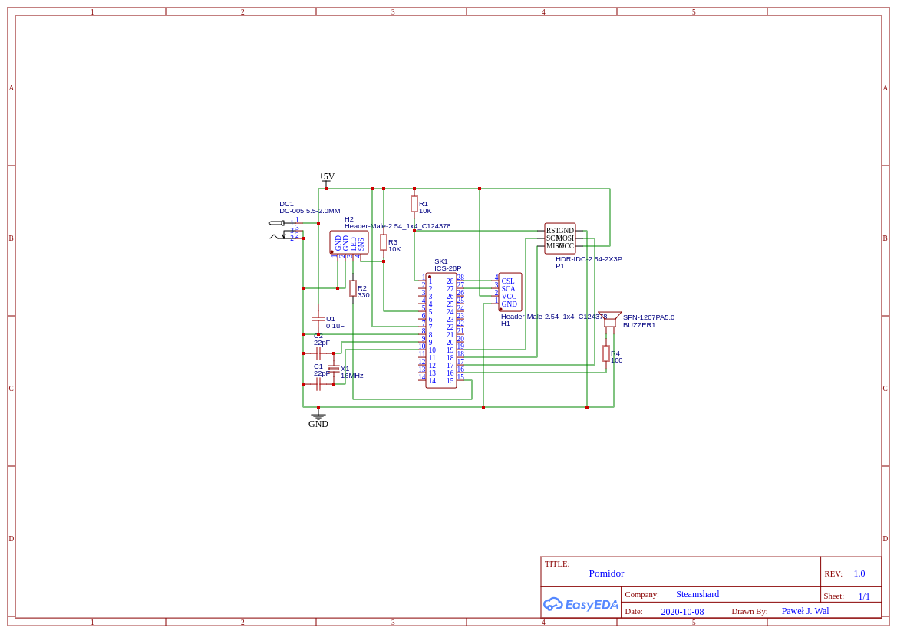

# pomidor

Software for a hardware Pomodoro timer, built on ATmega328p and assorted cruft I amassed over the years.

The joke is "pomidor" means "tomato" in Polish.

## Usage

Assuming you have your avrispmkII attached to your ATmega328p breakout/dev board that you handwired yourself in _exactly_ the same way I did:

```
git submodule init
git submodule sync
make ispload
```

## Board schematic



This will also serve as a full devboard (I want this gadget to be reprogrammable, so I included a full ISP header in the design). H1 will accept a HD44780-compatible LCD with an I2C expander pack, and H2 produces a split ground, LED control and sense pin for an arcade-style button. **I have not yet validated the design on a produced PCB, stay tuned.**

This also makes the design reasonably open - conceivably, this board can be used for any LCD+arcadebutton+piezo speaker project, which is quite a wide range of applications. The arcadebutton portion can be split into a microswitch + LED combo thanks to the split ground on H2.

Adding female breakout headers to this project should also be reasonably easy, but I don't need one and it's a ton of very boring wiring, so feel free to augment the design yourself ;)

In terms of possible improvements: I ran out of time for diodes. I used this as a devboard successfully, but I assume that if I tried to power both the barrel plug and plug my ISP into a laptop, I may be out an USB port, an ISP, an atmega328, and if everything goes wrong - a laptop. You were warned.

## Credits

* hd44780 library from https://github.com/duinoWitchery/hd44780
