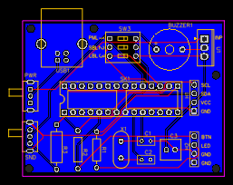

# pomidor v2.0

Software for a hardware Pomodoro timer, built on ATmega328p and assorted cruft I amassed over the years.

The joke is "pomidor" means "tomato" in Polish.

## Features

* Variable pomodoro length (25/50min)
* Variable short break length (5/10min)
* Variable long break length (15/30min)
* Audible cue on pomodoro end/break end
* Visual cue on pomodoro end (LCD backlight sleeps after 5s of inactivity, wakes up for break)
* Customization as easy as modifying `config.h`

## Usage

Assuming:

* you have an ATmega328p with an Arduino bootloader
* you're using and `AVRispMkII` programmer

it's as easy as:

```
git submodule init
git submodule sync
make ispload
```

Otherwise please refer to manufacturer/search engine of choice for using it with Arduino and update `Makefile` as required.

I haven't verified this with any other Atmel chips. I don't see a reason it wouldn't work if you can compile and upload the sketch, and that your chip has enough pins.

ATmega328 is an absolute chonker in terms of I/O, so many things in this design are taking advantage of it - it can probably be simplified for a smaller footprint chip with enough shift registers and other assorted stuff.

Please also note that while I'm happy to help if you want to try it, for legal reasons this repository is presented as-is.

## Board schematic


### Board features

* USB-B power plug
* Power stabilization (5v)
* Physical sound and power switches - no software trickery, as it should be
* DIP switches for end-user configuration (well, not _really_ end user, but it's better than having to reprogram the chip for it every time)

## Possible board outline



The schematic is verified now and I have manufactured a board from this circuit which audited correctly.

Idea for this outline is to expose the USB plug and switches off the side, where they can be incorporated into a case neatly.

An example Bill of Materials is available in [bom.csv](bom.csv).

## Credits

* hd44780 library from https://github.com/duinoWitchery/hd44780
